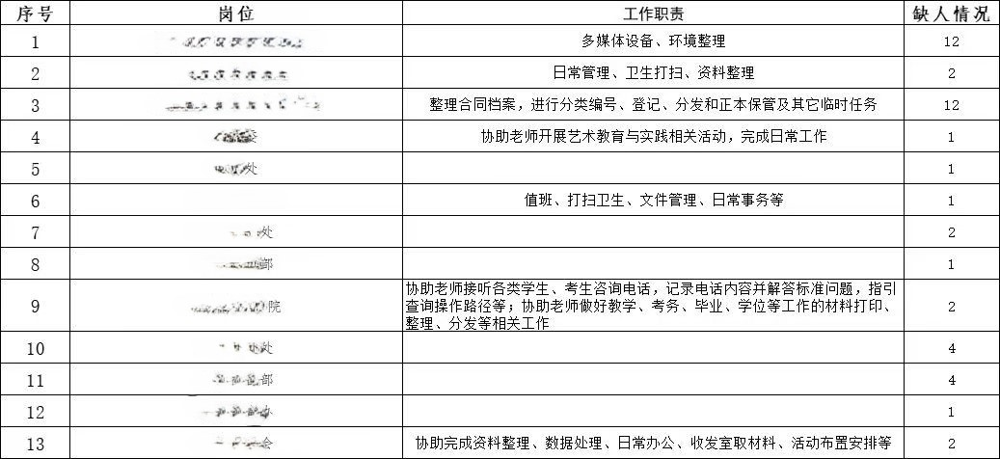

    不同学校政策和发布方式不同。
    欢迎大家指正或补充～

# 学校官方勤工俭学

> - 学校官网发布的勤工俭学信息，不同学校发布的网站不同,例如清华大学发布在[学生资助服务中心](https://www.sfao.pku.edu.cn/qgzx/jsxg/index.html/#/index)。不过往往显示的比较滞后。

> - 学校的勤工助学岗位会通过学校设置的学生组织向全体学生发布，下面以笔者母校为例，举>其中一次发布的岗位，部分信息予以隐藏：

    学校现需招募45名有意向做职能部门勤工助学工作的学生。现把各职能部门缺人情况发给大家，请转发给需要的学生，由于资助科24日上午要材料，请通知咱们学生于X月X日（今天）下午X点前把《勤工助学岗位申请表》送至209办公室。

> - 随之发布的还有一张申请表
>   按要求填写、提交申请表，通过审核后就可以获得勤工助学岗位了。据笔者小道消息，这些岗位工作时间不固定，看老师的需要，每月最高 600 元。

> - 勤工助学不是每年都有，是根据学校各部门需求来决定的，所以有需要的同学遇到就别放过哟。也是一个认识老师、了解学校的机会。

# 非学校官方

> - 学校餐厅的打饭窗口、校外的餐厅面包店等等，这些都是会有店主找兼职同学的。

> - 打饭窗口的兼职信息往往是直接粘贴再窗口旁、或在一些公共渠道发布的。也有人拉人的情况，被补了就不再往外放信息了。

> - 笔者一位上海某 211 的同学分享了他的经历：他在校外找到了一家蛋糕店，成为了兼职店员。店的大老板已经财富自由了，偶尔来店里转一圈；店长没有业绩要求，大老板也不在乎店里盈亏，所以店长基本摆烂；店员都很年轻，大家去店里基本就是聊天，做做蛋糕、吃吃蛋糕，依然拿工资。（也是狠狠羡慕了）所以在大城市的兼职机会还是很多的，大家可以大胆尝试。
