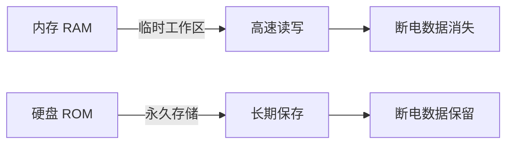
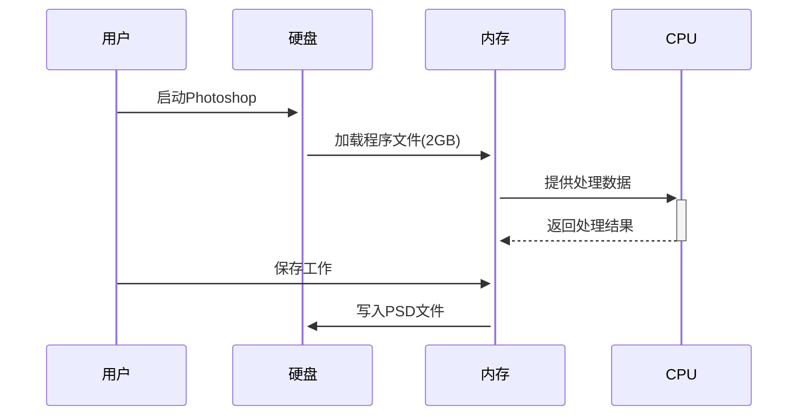

# 内存与硬盘：计算机的"工作台"与"储藏室"

## 核心区别图解



## 内存（RAM）：计算机的"工作台"


> **内存**是计算机的**临时工作区**，相当于书桌上正在使用的空间。所有运行中的程序和数据都必须加载到内存中才能被 CPU 处理。

### 关键特性

| 特性         | 说明                | 实际影响           |
| ------------ | ------------------- | ------------------ |
| **易失性**   | 断电后数据立即消失  | 未保存的工作会丢失 |
| **高速访问** | 比硬盘快 100 倍以上 | 程序运行更流畅     |
| **容量限制** | 通常 4GB-128GB      | 决定多任务处理能力 |
| **物理形态** | 可插拔的长条形模块  | 可后期升级         |

**用户须知**：

- 内存 ≠ 存储空间！512GB 指的是硬盘容量，不是内存
- 内存不足的表现：
  - 程序频繁卡顿
  - 浏览器标签页崩溃
  - 出现"内存不足"警告
- 2023 年推荐配置：
  - 基础办公：8GB
  - 游戏/设计：16-32GB
  - 专业工作站：64GB+

## 硬盘：计算机的"储藏室"


> **硬盘**是计算机的**永久存储设备**，相当于家里的书柜和储物间。操作系统、程序文件和个人数据都存储在硬盘中。

### 硬盘类型对比

| 类型             | 速度                       | 寿命                       | 价格 | 数据恢复   | 典型场景      |
| ---------------- | -------------------------- | -------------------------- | ---- | ---------- | ------------- |
| **SSD 固态硬盘** | 极快<br>(500-7000 MB/s)    | 有限写入次数<br>(TBW 指标) | 较高 | 几乎不可能 | 系统盘/游戏盘 |
| **HDD 机械硬盘** | 较慢<br>(100-200 MB/s)     | 机械损耗<br>(约 5 万小时)  | 低廉 | 可能恢复   | 数据备份盘    |
| **NVMe SSD**     | 超高速<br>(3500-7000 MB/s) | 同 SSD                     | 昂贵 | 不可能     | 专业工作站    |

### 关键概念解析

1. **分区管理**：

   - 单个硬盘可划分为多个分区（如 C 盘、D 盘）
   - 分区如同储物间的隔断，方便分类管理
   - 系统分区 (C 盘) 建议≥256GB

2. **数据安全**：

   ```mermaid
   graph TB
       删除操作 --> 回收站 -->|清空 | 文件索引移除
       真正删除 --> 数据覆盖 --> 物理擦除
   ```

   - SSD 数据删除后难以恢复（TRIM 指令立即擦除）
   - HDD 删除文件后，在未被覆盖前可尝试恢复

3. **混合存储方案**：
   - 最佳实践：SSD(系统 + 常用程序) + HDD(数据存储)
   - 性价比配置：512GB NVMe SSD + 2TB HDD

## 内存与硬盘协同工作流程



## 选购指南

### 内存选购要点

1. 匹配主板：DDR4/DDR5 不能混用
2. 频率选择：DDR4 3200MHz 或 DDR5 4800MHz 起
3. 双通道配置：2x8GB 优于 1x16GB

### 硬盘选购要点

| 需求   | 推荐方案       | 品牌参考                        |
| ------ | -------------- | ------------------------------- |
| 系统盘 | NVMe SSD 500GB | 三星 980 Pro<br>西部数据 SN770  |
| 游戏库 | SATA SSD 1-2TB | 金士顿 KC600<br>致钛 TiPlus5000 |
| 媒体库 | HDD 4-8TB      | 希捷酷狼<br>西数红盘            |

## 维护建议

### 内存优化

- 禁用无用开机启动项
- 浏览器限制标签页数量
- 定期重启释放内存

### 硬盘维护

- SSD 保留 20% 空闲空间
- HDD 避免物理震动
- 定期备份重要数据（3-2-1 原则）：

  ```markdown
  3 份副本 - 2 种介质 - 1 份异地
  ```

## 技术演进趋势

1. **内存技术**：

   - DDR5 普及（4800MHz 起）
   - 非易失性内存（Intel Optane）

2. **存储技术**：
   - PCIe 5.0 SSD（14GB/s+）
   - QLC SSD 大容量普及
   - 云存储无缝集成

> **终极提示**：2023 年新机组装**务必选择 SSD 作为系统盘**，机械硬盘仅适合冷数据存储。内存配置不应低于 16GB 以保证未来 3-5 年的使用需求。

## 参考

- [内存技术发展白皮书](https://www.jedec.org/dram)
- [SSD vs HDD 性能对比](https://www.storagereview.com/review/comparison)
- [数据恢复原理](https://www.ntfs.com/data-recovery.htm)
- [3-2-1 备份法则](https://www.backblaze.com/blog/the-3-2-1-backup-strategy/)
