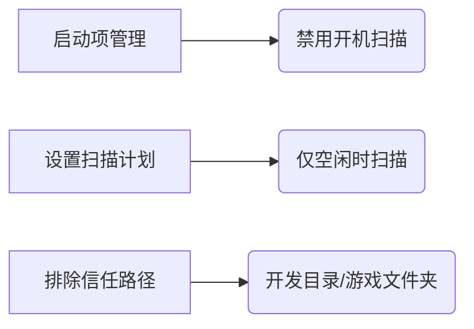

# 杀毒软件与防火墙：现代计算机的必备防护

## 我需要杀毒软件吗？

**绝对需要！** 尽管传统计算机病毒在 2023 年已较少见，但数字威胁已演变为更隐蔽的形式：

| 威胁类型   | 发生率 | 主要危害             | 防护关键     |
| ---------- | ------ | -------------------- | ------------ |
| 勒索软件   | 高     | 加密文件索要赎金     | 实时行为监控 |
| 流氓软件   | 极高   | 广告弹窗/隐私窃取    | 捆绑安装拦截 |
| 钓鱼攻击   | 极高   | 窃取账号密码         | 网页防护     |
| 挖矿木马   | 中     | 占用资源导致设备卡顿 | 进程监控     |
| 供应链攻击 | 上升中 | 通过合法软件传播     | 软件来源验证 |

## 主流杀毒软件深度评测

### 1. 火绒安全

- **核心优势**：
  - **零广告干扰**：纯净无推广
  - **超低资源占用**：内存<50MB，CPU<1%
  - **专业工具集**：
    - 启动项管理
    - 网络流量监控
    - Hosts 文件编辑器
    - 漏洞修复
- **适用场景**：
  - 技术用户自定义防护
  - 老旧设备优化
  - 开发环境（避免误报）
- **不足**：病毒库更新频率较低（每日 1 次）
- [官网下载](https://www.huorong.cn/)

### 2. 360 安全卫士

- **核心优势**：
  - **云查杀引擎**：分钟级威胁响应
  - **勒索防护**：专属文档保护功能
  - **实用工具**：
    - 驱动修复
    - 断网急救箱
    - 系统备份还原
- **配置建议**：

  ```markdown
  1. 设置中心 > 弹窗设置：关闭所有推广选项
  2. 功能大全 > 右键菜单管理：删除多余项
  3. 安全防护中心 > 核晶防护：开启（需 VT 支持）
  ```

- **警惕点**：安装时取消勾选"360 浏览器"等捆绑项
- [官网下载](https://weishi.360.cn/)

### 3. 腾讯电脑管家

- **突出特性**：
  - **微信联动**：安全通知直达微信
  - **账号保护**：特别强化 QQ/微信防护
  - **权限雷达**：精细控制应用权限
- **优化方案**：
  - 关闭"每日精选"资讯推送
  - 禁用"软件管理"自动升级
  - 开启"上网安全防护"中的钓鱼网站拦截
- [官网下载](https://pc.qq.com/)

### 国际替代方案（推荐进阶用户）

| 名称             | 特点                   | 资源占用 | 中文支持 |
| ---------------- | ---------------------- | -------- | -------- |
| **Bitdefender**  | 连续 5 年 AV-TEST 满分 | 中等     | 完善     |
| **Kaspersky**    | 顶级启发式扫描         | 中等     | 完善     |
| **Malwarebytes** | 专注反恶意软件         | 低       | 基础     |

## 科学配置四原则

### 1. 核心功能必开启

- **捆绑安装拦截**（所有杀软必备）
- **弹窗过滤器**（尤其对付国内软件）
- **实时文件监控**（访问时扫描）
- **行为防护**（对抗零日威胁）

### 2. 资源占用优化



### 3. 扫描策略建议

- **快速扫描**：每日自动执行（耗时<5 分钟）
- **全盘扫描**：月度手动执行（安装新软件后必做）
- **U 盘接入扫描**：务必开启

### 4. 避免功能滥用

- **❌ 电脑体检**：制造焦虑的无效功能
- **❌ 加速球**：实际可能拖慢系统
- **✅ 漏洞修复**：仅需安装高危补丁

> **盈利模式真相**：免费杀软通过以下方式盈利：
>
> - 导航站推广（每安装获利¥2-5）
> - 软件分发佣金（每安装¥0.5-3）
> - 会员增值服务（如数据恢复）

## Windows 防火墙深度解析

### 为什么必须开启？

1. **IPv6 普及风险**：

   - 现代家庭宽带普遍分配公网 IPv6 地址
   - 设备直接暴露在互联网（如`2408:8207:7890::/48`）
   - 黑客可通过扫描工具发现开放端口

2. **典型攻击场景**：

   ```mermaid
    sequenceDiagram
        actor 攻击者
        participant 受害者设备
        攻击者 ->>+ 受害者设备：扫描 IPv6 地址段
        受害者设备 -->>- 攻击者：响应开放端口 (如 445)
        攻击者 ->> 受害者设备：利用 SMB 漏洞植入木马
   ```

### 最佳配置方案

| 配置文件     | 推荐设置         | 适用场景         |
| ------------ | ---------------- | ---------------- |
| **专用网络** | 阻止所有入站连接 | 家庭/公司网络    |
| **公用网络** | 严格模式         | 咖啡馆/机场 WiFi |
| **域网络**   | 默认设置         | 企业域环境       |

### 高级防护策略

1. **出站规则控制**：
   - 阻止可疑程序联网（如盗版软件激活器）
   - 路径：`高级安全防火墙 > 出站规则 > 新建规则`
2. **端口管理**：

   - 关闭高风险端口：
     - 135/TCP/UDP (RPC)
     - 445/TCP (SMB)
     - 3389/TCP (远程桌面)

3. **应用例外**：
   - 仅允许知名程序通过防火墙
   - 示例白名单：

     ```markdown
     chrome.exe
     wechat.exe
     teams.exe
     ```

> **重要提醒**：无论使用何种防护方案，**定期备份**（3-2-1 原则）是应对勒索软件的最后防线。建议使用 Veeam/Acronis 等专业工具执行系统镜像备份。

## 终极安全建议

1. **软件来源**：只从官网/微软商店下载
2. **更新策略**：启用系统/软件的自动更新
3. **权限管理**：普通账户日常使用
4. **密码体系**：密码管理器 + 双因素认证
5. **安全意识**：警惕邮件附件/不明链接

**防护是持续过程**，建议每季度审查一次安全配置，才能有效应对快速演变的威胁环境。
